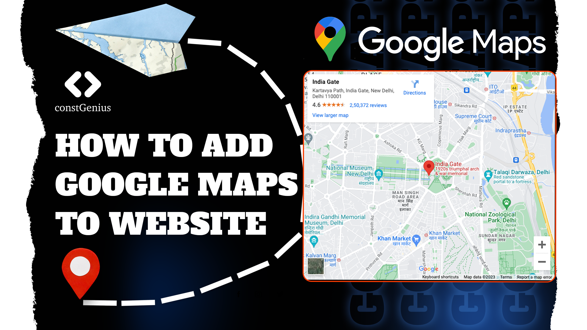

# How to Add Google Maps to Website | Embed Location Map on website

Enhance your website's user experience by adding Google Maps! With our step-by-step guide, you can effortlessly embed a location map on your website, making it simple for visitors to find your business or event. Improve accessibility and provide real-time directions, all with the power of Google Maps.

